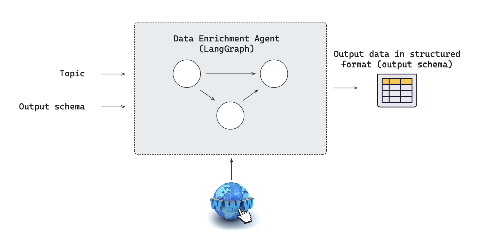
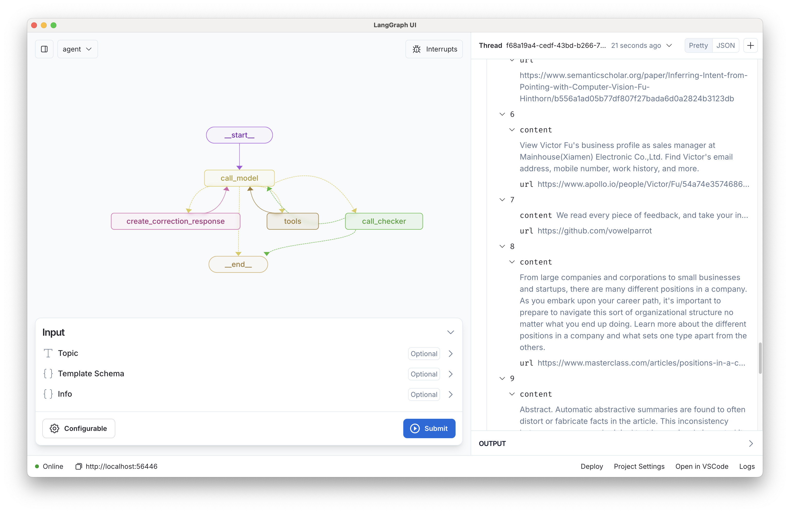
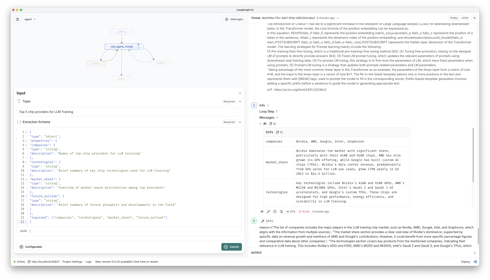
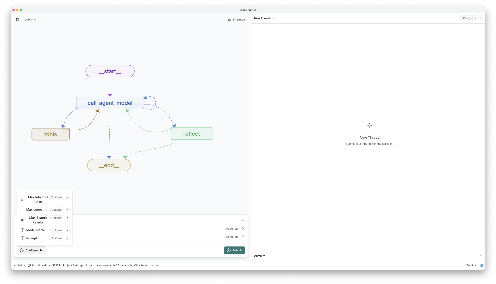

# LangGraph Data Enrichment Template

[](https://github.com/langchain-ai/data-enrichment/actions/workflows/unit-tests.yml)
[](https://github.com/langchain-ai/data-enrichment/actions/workflows/integration-tests.yml)
[![Open in - LangGraph Studio](https://img.shields.io/badge/Open_in-LangGraph_Studio-00324d.svg?logo=data:image/svg%2bxml;base64,PHN2ZyB4bWxucz0iaHR0cDovL3d3dy53My5vcmcvMjAwMC9zdmciIHdpZHRoPSI4NS4zMzMiIGhlaWdodD0iODUuMzMzIiB2ZXJzaW9uPSIxLjAiIHZpZXdCb3g9IjAgMCA2NCA2NCI+PHBhdGggZD0iTTEzIDcuOGMtNi4zIDMuMS03LjEgNi4zLTYuOCAyNS43LjQgMjQuNi4zIDI0LjUgMjUuOSAyNC41QzU3LjUgNTggNTggNTcuNSA1OCAzMi4zIDU4IDcuMyA1Ni43IDYgMzIgNmMtMTIuOCAwLTE2LjEuMy0xOSAxLjhtMzcuNiAxNi42YzIuOCAyLjggMy40IDQuMiAzLjQgNy42cy0uNiA0LjgtMy40IDcuNkw0Ny4yIDQzSDE2LjhsLTMuNC0zLjRjLTQuOC00LjgtNC44LTEwLjQgMC0xNS4ybDMuNC0zLjRoMzAuNHoiLz48cGF0aCBkPSJNMTguOSAyNS42Yy0xLjEgMS4zLTEgMS43LjQgMi41LjkuNiAxLjcgMS44IDEuNyAyLjcgMCAxIC43IDIuOCAxLjYgNC4xIDEuNCAxLjkgMS40IDIuNS4zIDMuMi0xIC42LS42LjkgMS40LjkgMS41IDAgMi43LS41IDIuNy0xIDAtLjYgMS4xLS44IDIuNi0uNGwyLjYuNy0xLjgtMi45Yy01LjktOS4zLTkuNC0xMi4zLTExLjUtOS44TTM5IDI2YzAgMS4xLS45IDIuNS0yIDMuMi0yLjQgMS41LTIuNiAzLjQtLjUgNC4yLjguMyAyIDEuNyAyLjUgMy4xLjYgMS41IDEuNCAyLjMgMiAyIDEuNS0uOSAxLjItMy41LS40LTMuNS0yLjEgMC0yLjgtMi44LS44LTMuMyAxLjYtLjQgMS42LS41IDAtLjYtMS4xLS4xLTEuNS0uNi0xLjItMS42LjctMS43IDMuMy0yLjEgMy41LS41LjEuNS4yIDEuNi4zIDIuMiAwIC43LjkgMS40IDEuOSAxLjYgMi4xLjQgMi4zLTIuMy4yLTMuMi0uOC0uMy0yLTEuNy0yLjUtMy4xLTEuMS0zLTMtMy4zLTMtLjUiLz48L3N2Zz4=)](https://langgraph-studio.vercel.app/templates/open?githubUrl=https://github.com/langchain-ai/data-enrichment)

Producing structured results (e.g., to populate a database or spreadsheet) from open-ended research (e.g., web research) is a common use case that LLM-powered agents are well-suited to handle. Here, we provide a general template for this kind of "data enrichment agent" agent using [LangGraph](https://github.com/langchain-ai/langgraph) in [LangGraph Studio](https://github.com/langchain-ai/langgraph-studio). It contains an example graph exported from `src/enrichment_agent/graph.py` that implements a research assistant capable of automatically gathering information on various topics from the web and structuring the results into a user-defined JSON format.



## What it does

The enrichment agent defined in `src/enrichment_agent/graph.py` performs the following steps:

1. Takes a research **topic** and requested **extraction_schema** as input.
2. Searches the web for relevant information
3. Reads and extracts key details from websites
4. Organizes the findings into the requested structured format
5. Validates the gathered information for completeness and accuracy



## Getting Started

Assuming you have already [installed LangGraph Studio](https://github.com/langchain-ai/langgraph-studio?tab=readme-ov-file#download), to set up:

1. Create a `.env` file.

```bash
cp .env.example .env
```

2. Define required API keys in your `.env` file.

The primary [search tool](./src/enrichment_agent/tools.py) [^1] used is [Tavily](https://tavily.com/). Create an API key [here](https://app.tavily.com/sign-in).

<!--
Setup instruction auto-generated by `langgraph template lock`. DO NOT EDIT MANUALLY.
-->

### Setup Model

The defaults values for `model` are shown below:

```yaml
model: anthropic/claude-3-5-sonnet-20240620
```

Follow the instructions below to get set up, or pick one of the additional options.

#### Anthropic

To use Anthropic's chat models:

1. Sign up for an [Anthropic API key](https://console.anthropic.com/) if you haven't already.
2. Once you have your API key, add it to your `.env` file:

```
ANTHROPIC_API_KEY=your-api-key
```
#### OpenAI

To use OpenAI's chat models:

1. Sign up for an [OpenAI API key](https://platform.openai.com/signup).
2. Once you have your API key, add it to your `.env` file:
```
OPENAI_API_KEY=your-api-key
```


<!--
End setup instructions
-->

3. Consider a research topic and desired extraction schema.

As an example, here is a research topic we can consider.

```
"Top 5 chip providers for LLM Training"
```

And here is a desired extraction schema (pasted in as "`extraction_schema`"):

```json
{
    "type": "object",
    "properties": {
        "companies": {
            "type": "array",
            "items": {
                "type": "object",
                "properties": {
                    "name": {
                        "type": "string",
                        "description": "Company name"
                    },
                    "technologies": {
                        "type": "string",
                        "description": "Brief summary of key technologies used by the company"
                    },
                    "market_share": {
                        "type": "string",
                        "description": "Overview of market share for this company"
                    },
                    "future_outlook": {
                        "type": "string",
                        "description": "Brief summary of future prospects and developments in the field for this company"
                    },
                    "key_powers": {
                        "type": "string",
                        "description": "Which of the 7 Powers (Scale Economies, Network Economies, Counter Positioning, Switching Costs, Branding, Cornered Resource, Process Power) best describe this company's competitive advantage"
                    }
                },
                "required": ["name", "technologies", "market_share", "future_outlook"]
            },
            "description": "List of companies"
        }
    },
    "required": ["companies"]
}
```

4. Open the folder LangGraph Studio, and input `topic` and `extraction_schema`.



## How to customize

1. **Customize research targets**: Provide a custom JSON `extraction_schema` when calling the graph to gather different types of information.
2. **Select a different model**: We default to anthropic (sonnet-35). You can select a compatible chat model using `provider/model-name` via configuration. Example: `openai/gpt-4o-mini`.
3. **Customize the prompt**: We provide a default prompt in [prompts.py](./src/enrichment_agent/prompts.py). You can easily update this via configuration.

For quick prototyping, these configurations can be set in the studio UI.



You can also quickly extend this template by:

- Adding new tools and API connections in [tools.py](./src/enrichment_agent/tools.py). These are just any python functions.
- Adding additional steps in [graph.py](./src/enrichment_agent/graph.py).

## Development

While iterating on your graph, you can edit past state and rerun your app from past states to debug specific nodes. Local changes will be automatically applied via hot reload. Try adding an interrupt before the agent calls tools, updating the default system message in `src/enrichment_agent/utils.py` to take on a persona, or adding additional nodes and edges!

Follow up requests will be appended to the same thread. You can create an entirely new thread, clearing previous history, using the `+` button in the top right.

You can find the latest (under construction) docs on [LangGraph](https://github.com/langchain-ai/langgraph) here, including examples and other references. Using those guides can help you pick the right patterns to adapt here for your use case.

LangGraph Studio also integrates with [LangSmith](https://smith.langchain.com/) for more in-depth tracing and collaboration with teammates.

[^1]: https://python.langchain.com/docs/concepts/#tools

## LangGraph API

We can also interact with the graph using the LangGraph API.

See `ntbk/testing.ipynb` for an example of how to do this.

LangGraph Cloud (see [here](https://langchain-ai.github.io/langgraph/cloud/#overview)) make it possible to deploy the agent.

<!--
Configuration auto-generated by `langgraph template lock`. DO NOT EDIT MANUALLY.
{
  "config_schemas": {
    "agent": {
      "type": "object",
      "properties": {
        "model": {
          "type": "string",
          "default": "anthropic/claude-3-5-sonnet-20240620",
          "description": "The name of the language model to use for the agent. Should be in the form: provider/model-name.",
          "environment": [
            {
              "value": "anthropic/claude-1.2",
              "variables": "ANTHROPIC_API_KEY"
            },
            {
              "value": "anthropic/claude-2.0",
              "variables": "ANTHROPIC_API_KEY"
            },
            {
              "value": "anthropic/claude-2.1",
              "variables": "ANTHROPIC_API_KEY"
            },
            {
              "value": "anthropic/claude-3-5-sonnet-20240620",
              "variables": "ANTHROPIC_API_KEY"
            },
            {
              "value": "anthropic/claude-3-haiku-20240307",
              "variables": "ANTHROPIC_API_KEY"
            },
            {
              "value": "anthropic/claude-3-opus-20240229",
              "variables": "ANTHROPIC_API_KEY"
            },
            {
              "value": "anthropic/claude-3-sonnet-20240229",
              "variables": "ANTHROPIC_API_KEY"
            },
            {
              "value": "anthropic/claude-instant-1.2",
              "variables": "ANTHROPIC_API_KEY"
            },
            {
              "value": "openai/gpt-3.5-turbo",
              "variables": "OPENAI_API_KEY"
            },
            {
              "value": "openai/gpt-3.5-turbo-0125",
              "variables": "OPENAI_API_KEY"
            },
            {
              "value": "openai/gpt-3.5-turbo-0301",
              "variables": "OPENAI_API_KEY"
            },
            {
              "value": "openai/gpt-3.5-turbo-0613",
              "variables": "OPENAI_API_KEY"
            },
            {
              "value": "openai/gpt-3.5-turbo-1106",
              "variables": "OPENAI_API_KEY"
            },
            {
              "value": "openai/gpt-3.5-turbo-16k",
              "variables": "OPENAI_API_KEY"
            },
            {
              "value": "openai/gpt-3.5-turbo-16k-0613",
              "variables": "OPENAI_API_KEY"
            },
            {
              "value": "openai/gpt-4",
              "variables": "OPENAI_API_KEY"
            },
            {
              "value": "openai/gpt-4-0125-preview",
              "variables": "OPENAI_API_KEY"
            },
            {
              "value": "openai/gpt-4-0314",
              "variables": "OPENAI_API_KEY"
            },
            {
              "value": "openai/gpt-4-0613",
              "variables": "OPENAI_API_KEY"
            },
            {
              "value": "openai/gpt-4-1106-preview",
              "variables": "OPENAI_API_KEY"
            },
            {
              "value": "openai/gpt-4-32k",
              "variables": "OPENAI_API_KEY"
            },
            {
              "value": "openai/gpt-4-32k-0314",
              "variables": "OPENAI_API_KEY"
            },
            {
              "value": "openai/gpt-4-32k-0613",
              "variables": "OPENAI_API_KEY"
            },
            {
              "value": "openai/gpt-4-turbo",
              "variables": "OPENAI_API_KEY"
            },
            {
              "value": "openai/gpt-4-turbo-preview",
              "variables": "OPENAI_API_KEY"
            },
            {
              "value": "openai/gpt-4-vision-preview",
              "variables": "OPENAI_API_KEY"
            },
            {
              "value": "openai/gpt-4o",
              "variables": "OPENAI_API_KEY"
            },
            {
              "value": "openai/gpt-4o-mini",
              "variables": "OPENAI_API_KEY"
            }
          ]
        }
      },
      "environment": [
        "TAVILY_API_KEY"
      ]
    }
  }
}
-->